# Customer Relationship and Product Management (CRPM) System

## Problem Statement:
Develop a comprehensive Customer Relationship and Product Management (CRPM) System that integrates backend functionality using Python and Object-Oriented Programming (OOP), a relational database, and a front-end framework. The application will enable users to manage customers, products, and customer purchases in a seamless, interactive interface.

## Requirements and Features

### 1. Customer Management

- Add Customers: Allow users to input customer details (Name, Email, Phone Number and other required information for your business).
- View Customers: Display a list of all customers stored in the database.
- Update Customer Details: Modify customer information using their unique Customer ID.
- Delete/De-activate Customers: Remove or de-activate customers from the system.

### 2. Product Management

- Add Products: Enable users to input product details (Name, Price, Stock Quantity and other required information for your business).
- View Products: Display a list of all available products.
- Update Product Details: Allow editing of product details such as name, price, and stock.
- Delete/De-activate Products: Remove or de-activate products from the system.

### 3.Customer Purchases

- Record Purchases: Enable users to log purchases by linking a customer to a product and specifying the quantity. Ensure the system updates product stock automatically after a purchase.
- View Purchase History: Display all purchases made by a specific customer, showing the product details, quantity purchased, and total cost.

### 4. Analytics and Reports

- Generate Sales Reports: Display total revenue generated, number of products sold, and stock updates and other key information.
- Display Top Customers: Rank customers based on their purchase history.
- Visualize Product Performance: Show product trends (e.g., best-selling and least-selling products).


### 5. User Interface
- Use a front-end framework (e.g., Streamlit, Gradio, Flask, or Django) to create an interactive user interface with the following features:
- Navigation between modules (Customer Management, Product Management, Purchases, Analytics).
- Forms for data input.
- Tables to display data.

## Approach:
### Data Cleaning and Preparation
Checking for missing values and handle them appropriately.
Converting data types where necessary (e.g., dates, numerical values).
Merging datasets where necessary for analysis (e.g., linking sales data with product and customer data).
### Load Data
Inserting the preprocessed data into an SQL database by creating relevant tables for each data source and using SQL INSERT statements to load the data.
### Develop the StreamLit Application
Formulating and executing functions to extract key insights from the data. These function address the business requirements mentioned.

## Analysis Steps:

### Customer Analysis
Demographic Distribution: Analyze the distribution of customers based on gender, age (calculated from birthday), location (city, state, country, continent).
Purchase Patterns: Identify purchasing patterns such as average order value, frequency of purchases, and preferred products.
Segmentation: Segment customers based on demographics and purchasing behavior to identify key customer groups.
### Sales Analysis
Overall Sales Performance: Analyze total sales over time, identifying trends and seasonality
Sales by Product: Evaluate which products are the top performers in terms of quantity sold and revenue generated.
Sales by Store: Assess the performance of different stores based on sales data.
Sales by Currency: Examine how different currencies impact sales figures, considering exchange rates.
### Product Analysis
Product Popularity: Identify the most and least popular products based on sales data.
Profitability Analysis: Calculate profit margins for products by comparing unit cost and unit price.
Category Analysis: Analyze sales performance across different product categories and subcategories.


## StreamLit steps:

## Customer Management Page

```python

def add_customer():
    with st.form("add_customer_form"):
        name = st.text_input("Name")
        gender = st.selectbox("Gender", ["Male", "Female", "Other"])
        city = st.text_input("City")
        state = st.text_input("State")
        country = st.text_input("Country")
        age = st.number_input("Age", min_value=0, max_value=120, step=1)
        submit = st.form_submit_button("Add Customer")

        if submit:
            query = """
            INSERT INTO Customers (Name, Gender, City, State, Country, Age, AgeRange)
            VALUES (%s, %s, %s, %s, %s, %s, %s)
            """
            if age < 20:
                age_range = "< 20"
            elif 20 <= age <= 29:
                age_range = "20-29"
            elif 30 <= age <= 39:
                age_range = "30-39"
            elif 40 <= age <= 49:
                age_range = "40-49"
            elif 50 <= age <= 59:
                age_range = "50-59"
            else:
                age_range = "60 and above"

            execute_query(query, (name, gender, city, state, country, age, age_range))
            st.success("Customer added successfully!")

def view_customers():
    query = "SELECT * FROM Customers"
    customers = fetch_data(query)
    st.write("### Customer List")
    st.dataframe(customers)


```

Here we can add new customers, and view available customers
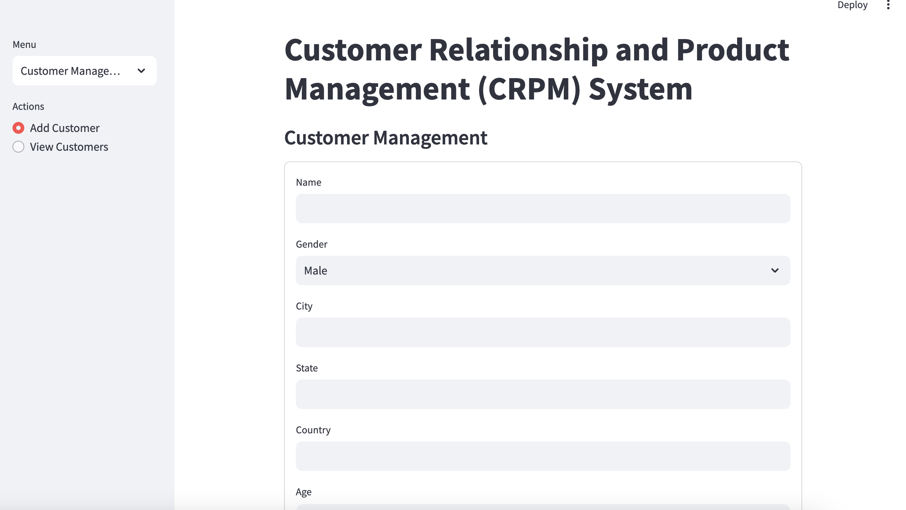
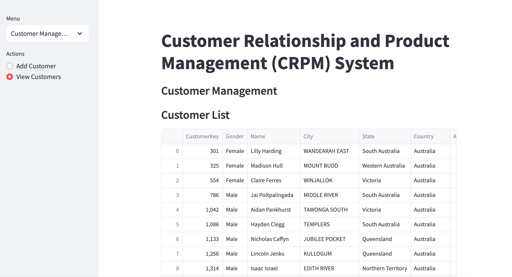

## Product Management Page

```python

def add_product():
    with st.form("add_product_form"):
        product_name = st.text_input("Product Name")
        brand = st.text_input("Brand")
        color = st.text_input("Color")
        unit_cost = st.number_input("Unit Cost (USD)", min_value=0.0, step=0.01)
        unit_price = st.number_input("Unit Price (USD)", min_value=0.0, step=0.01)

        # Fetch distinct subcategory and category from the Products table
        subcategory_query = "SELECT DISTINCT Subcategory FROM Products WHERE Subcategory IS NOT NULL"
        category_query = "SELECT DISTINCT Category FROM Products WHERE Category IS NOT NULL"

        subcategory_options = fetch_data(subcategory_query)['Subcategory'].tolist()
        category_options = fetch_data(category_query)['Category'].tolist()

        # Subcategory Dropdown
        subcategory = st.selectbox("Subcategory", subcategory_options)
        if subcategory:
            # If the user wants to enter a new subcategory, provide a text input
            new_subcategory = st.text_input("Or enter new subcategory")
            if new_subcategory:
                subcategory = new_subcategory  # Use new subcategory value entered by the user

        # Category Dropdown
        category = st.selectbox("Category", category_options)
        if category:
            # If the user wants to enter a new category, provide a text input
            new_category = st.text_input("Or enter new category")
            if new_category:
                category = new_category  # Use new category value entered by the user

        # Stock Level Input
        stock_level = st.number_input("Initial Stock Level", min_value=0, step=1)

        # Active Status Checkbox
        is_active = st.checkbox("Is Active", value=True)  # Default value is True (Active)

        submit = st.form_submit_button("Add Product")

        if submit:
            # Insert product details into the Products table
            query = """
            INSERT INTO Products (ProductName, Brand, Color, UnitCostUSD, UnitPriceUSD, Subcategory, Category, StockLevel, IsActive)
            VALUES (%s, %s, %s, %s, %s, %s, %s, %s, %s)
            """
            execute_query(query, (product_name, brand, color, unit_cost, unit_price, subcategory, category, stock_level, is_active))

            st.success("Product added successfully!")

def edit_product():
    # Fetch product data
    products = fetch_data("SELECT ProductKey, ProductName, IsActive FROM Products")

    # Allow user to select the product to edit
    product_names = products['ProductName'].tolist()
    selected_product_name = st.selectbox("Select a product to edit", product_names)

    # Get ProductKey based on selected product
    selected_product = products[products['ProductName'] == selected_product_name]
    product_key = selected_product['ProductKey'].values[0]
    current_status = selected_product['IsActive'].values[0]

    # Convert the values to Python int (in case they are numpy.int64)
    product_key = int(product_key)
    current_status = int(current_status)

    # Display current status and allow user to change it
    new_status = st.radio("Select status", ["Active", "Inactive"], index=0 if current_status == 1 else 1)

    if st.button("Update Product Status"):
        # Update the product's active status in the database
        new_status_value = 1 if new_status == "Active" else 0
        new_status_value = int(new_status_value)  # Ensure it's a Python int

        update_status_query = """
        UPDATE Products
        SET IsActive = %s
        WHERE ProductKey = %s
        """
        execute_query(update_status_query, (new_status_value, product_key))
        st.success(f"Product '{selected_product_name}' status updated to {new_status}.")

def view_products():
    query = "SELECT * FROM Products"
    products = fetch_data(query)
    st.write("### Product List")
    st.dataframe(products)

```
Here we can add new products, view available products, and also change the status of the product to active or inactive
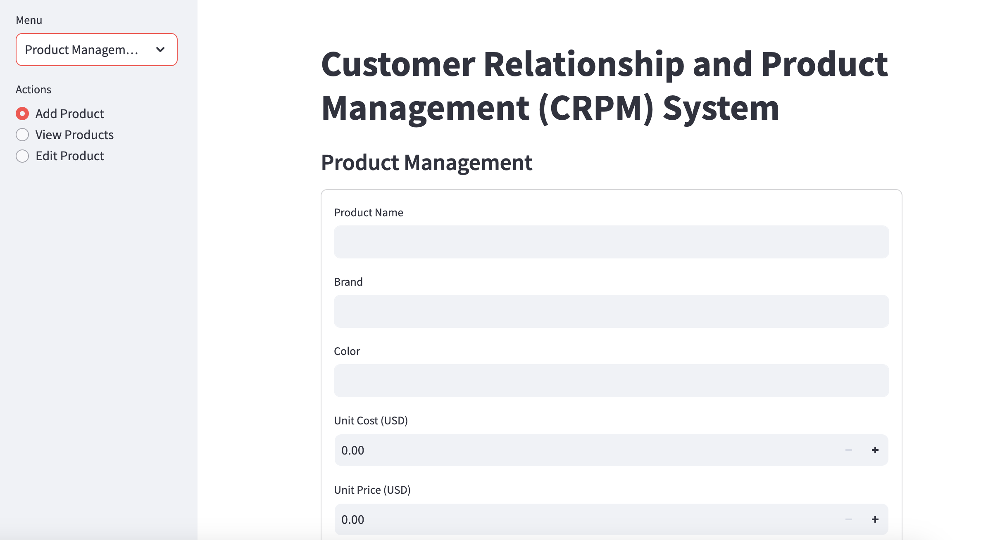
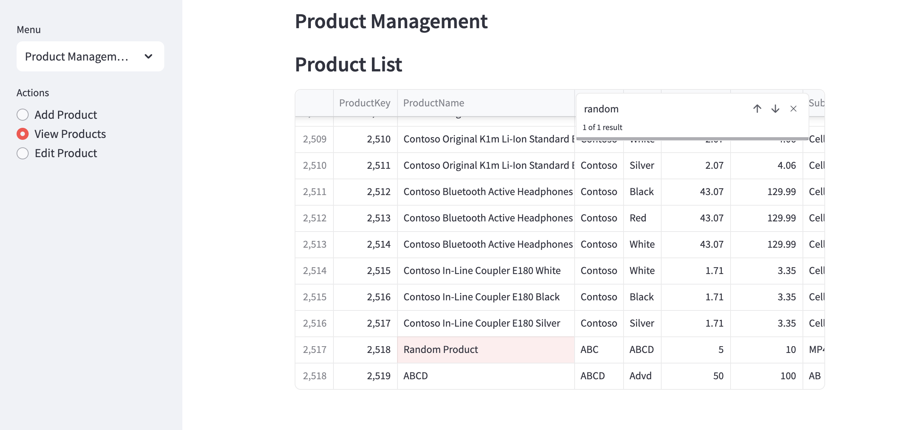
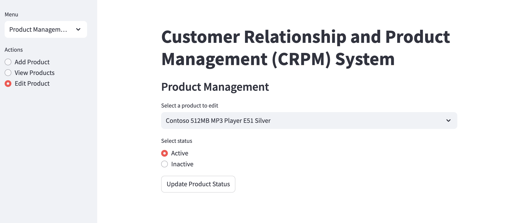
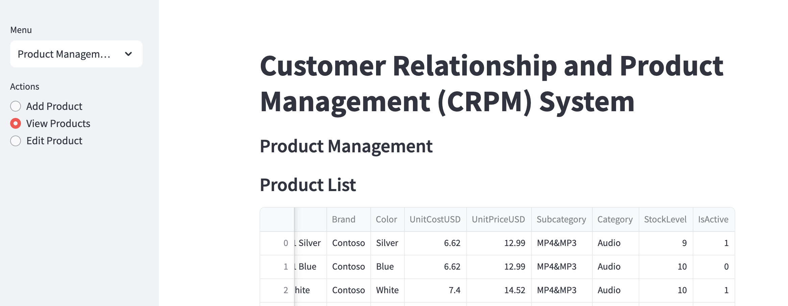

## Customer Purchase

```python

def record_purchase():
    # Step 1: Select the number of products in the order
    num_products = st.radio("How many products in the order?", [1, 2, 3, 4, 5], index=0)

    # Step 2: Show product selection and quantity fields based on the number of products selected
    if num_products:
        # Fetch customer and product data
        customers = fetch_data("SELECT CustomerKey, Name FROM Customers")
        products = fetch_data("SELECT ProductKey, ProductName FROM Products")

        # Customer selection dropdown
        customer_id = st.selectbox("Select Customer", customers['CustomerKey'].tolist(),
                                   format_func=lambda x: customers[customers['CustomerKey'] == x]['Name'].values[0])

        # Step 2b: Use st.form() to wrap the product selection inputs and submit button
        with st.form(key="order_form"):
            product_details = []
            for i in range(num_products):
                st.subheader(f"Line Item {i + 1}")

                # Product selection dropdown
                product_name = st.selectbox(f"Select Product {i+1}", products['ProductName'].tolist(), key=f"product_{i}")

                # Quantity input field
                quantity = st.number_input(f"Quantity for {product_name}", min_value=1, step=1, key=f"quantity_{i}")

                # Get the ProductKey for the selected product
                product_id = products[products['ProductName'] == product_name].iloc[0]['ProductKey']

                product_details.append({
                    "product_id": product_id,
                    "quantity": quantity,
                    "product_name": product_name
                })

            # Step 3: Submit the form to record the purchase
            submit_order = st.form_submit_button("Record Purchase")

            if submit_order:
                # Ensure the order is processed only once
                with st.spinner("Recording purchase..."):
                    try:
                        # Step 3a: Retrieve the maximum OrderNumber from the Sales table and increment it by 1
                        max_order_number_query = "SELECT MAX(OrderNumber) AS MaxOrderNumber FROM Sales"
                        max_order_number = fetch_data(max_order_number_query)

                        # Convert numpy.int64 to Python int
                        new_order_number = int(max_order_number['MaxOrderNumber'][0]) + 1 if max_order_number['MaxOrderNumber'][0] is not None else 1

                        # Step 3b: Insert the order along with LineItem as 1 (since this is the first line item)
                        sale_query = """
                        INSERT INTO Sales (OrderNumber, LineItem, OrderDate, CustomerKey)
                        VALUES (%s, 1, CURDATE(), %s)
                        """
                        execute_query(sale_query, (new_order_number, int(customer_id)))  # Ensure customer_id is int

                        # Step 3c: For each product in the order, insert line items and update stock levels
                        for product in product_details:
                            product_id = int(product["product_id"])  # Ensure product_id is int
                            quantity = int(product["quantity"])      # Ensure quantity is int

                            # Get the maximum LineItem for the current OrderNumber
                            max_line_item_query = f"SELECT MAX(LineItem) AS MaxLineItem FROM Sales WHERE OrderNumber = {new_order_number}"
                            max_line_item = fetch_data(max_line_item_query)

                            # Convert numpy.int64 to Python int
                            line_item_number = int(max_line_item['MaxLineItem'][0]) + 1 if max_line_item['MaxLineItem'][0] is not None else 1

                            # Check if enough stock is available for each product
                            stock_query = "SELECT StockLevel FROM Products WHERE ProductKey = %s"
                            stock_level = fetch_data(stock_query, (product_id,))

                            if not stock_level.empty and int(stock_level['StockLevel'][0]) >= quantity:
                                # Insert each product as a line item in the Sales table, with the same OrderNumber
                                line_item_query = """
                                INSERT INTO Sales (OrderNumber, LineItem, OrderDate, CustomerKey, ProductKey, Quantity)
                                VALUES (%s, %s, CURDATE(), %s, %s, %s)
                                """
                                execute_query(line_item_query, (
                                    int(new_order_number),  # Ensure new_order_number is int
                                    line_item_number,       # line_item_number is already int
                                    int(customer_id),       # Ensure customer_id is int
                                    product_id,             # Ensure product_id is int
                                    quantity                # Ensure quantity is int
                                ))

                                # Update the stock level in the Products table
                                update_stock_query = "UPDATE Products SET StockLevel = StockLevel - %s WHERE ProductKey = %s"
                                execute_query(update_stock_query, (quantity, product_id))

                            else:
                                st.error(f"Insufficient stock for {product['product_name']}. Purchase could not be recorded.")

                        st.success("Purchase recorded successfully!")

                    except Exception as e:
                        st.error(f"An error occurred: {e}")

                    # Optionally reset the form after submission
                    st.session_state.order_form_submitted = True

def view_sales():
    query = """
    SELECT Sales.OrderNumber, Sales.OrderDate, Customers.Name AS Customer, Products.ProductName AS Product, Sales.Quantity
    FROM Sales
    JOIN Customers ON Sales.CustomerKey = Customers.CustomerKey
    JOIN Products ON Sales.ProductKey = Products.ProductKey
    """
    sales = fetch_data(query)
    st.write("### Sales Records")
    st.dataframe(sales)
```
Here we can add new customer orders, view available sales done as well

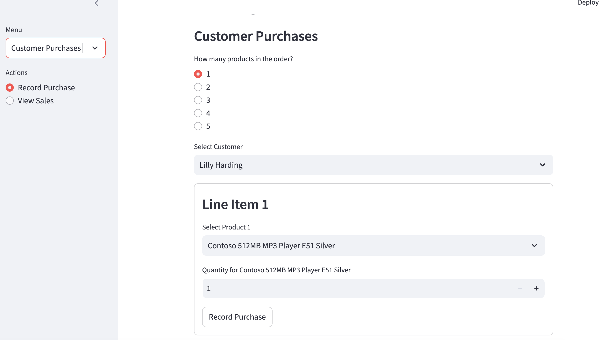
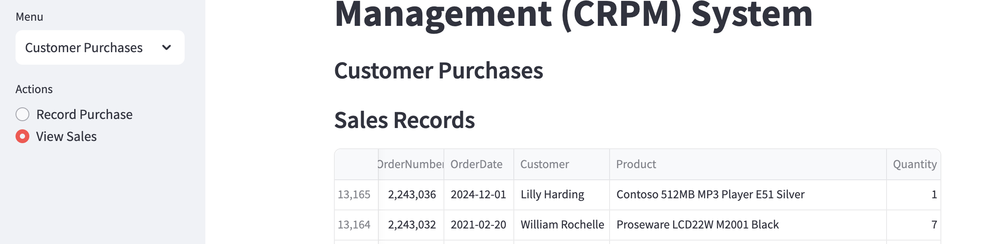

## Analytics Page

```python

def analytics():
    # Revenue Query
    revenue_query = """
    SELECT SUM(Sales.Quantity * Products.UnitPriceUSD) AS TotalRevenue
    FROM Sales
    JOIN Products ON Sales.ProductKey = Products.ProductKey
    """
    revenue = fetch_data(revenue_query)['TotalRevenue'][0]
    st.write(f"Total Revenue: ${revenue:.2f}")

    # Monthly Sales Data (Plotly or Matplotlib for a line chart)
    monthly_sales_query = """
    SELECT YEAR(OrderDate) AS Year, MONTH(OrderDate) AS Month, SUM(Sales.Quantity * Products.UnitPriceUSD) AS MonthlyRevenue
    FROM Sales
    JOIN Products ON Sales.ProductKey = Products.ProductKey
    GROUP BY YEAR(OrderDate), MONTH(OrderDate)
    ORDER BY Year DESC, Month DESC
    """
    monthly_sales = fetch_data(monthly_sales_query)
    monthly_sales['Date'] = pd.to_datetime(monthly_sales[['Year', 'Month']].assign(DAY=1))

    # Plot Monthly Sales
    fig = px.line(monthly_sales, x='Date', y='MonthlyRevenue', title="Monthly Sales",
                  labels={'MonthlyRevenue': 'Revenue ($)', 'Date': 'Month'})
    st.plotly_chart(fig)

    # Age Group Distribution (Bar chart)
    age_group_query = """
    SELECT 
        AgeRange,
        COUNT(*) AS CustomerCount
    FROM Customers
    GROUP BY AgeRange
    """
    age_group_data = fetch_data(age_group_query)

    # Plot Age Group Distribution
    fig3 = px.bar(age_group_data, x='AgeRange', y='CustomerCount', title="Customer Distribution by Age Range",
                  labels={'CustomerCount': 'Number of Customers'})
    st.plotly_chart(fig3)

    # Top 10 Products by Quantity Sold
    top_products_query = """
    SELECT Products.ProductName, SUM(Sales.Quantity) AS TotalQuantitySold
    FROM Sales
    JOIN Products ON Sales.ProductKey = Products.ProductKey
    GROUP BY Products.ProductName
    ORDER BY TotalQuantitySold DESC
    LIMIT 10;
    """
    top_products = fetch_data(top_products_query)

    # Plot Top 10 Products by Quantity Sold
    fig4 = px.bar(top_products, x='ProductName', y='TotalQuantitySold', title="Top 10 Products by Quantity Sold",
                  labels={'TotalQuantitySold': 'Quantity Sold'})
    st.plotly_chart(fig4)

    # Top 10 Products by Revenue
    top_products_revenue_query = """
       SELECT Products.ProductName, SUM(Sales.Quantity * Products.UnitPriceUSD) AS TotalRevenue
       FROM Sales
       JOIN Products ON Sales.ProductKey = Products.ProductKey
       GROUP BY Products.ProductName
       ORDER BY TotalRevenue DESC
       LIMIT 10;
       """
    top_products_revenue = fetch_data(top_products_revenue_query)

    # Plot Top 10 Products by Revenue
    fig5 = px.bar(top_products_revenue, x='ProductName', y='TotalRevenue', title="Top 10 Products by Revenue",
                  labels={'TotalRevenue': 'Revenue ($)'})
    st.plotly_chart(fig5)
```
Here we can see some analytics of the database 

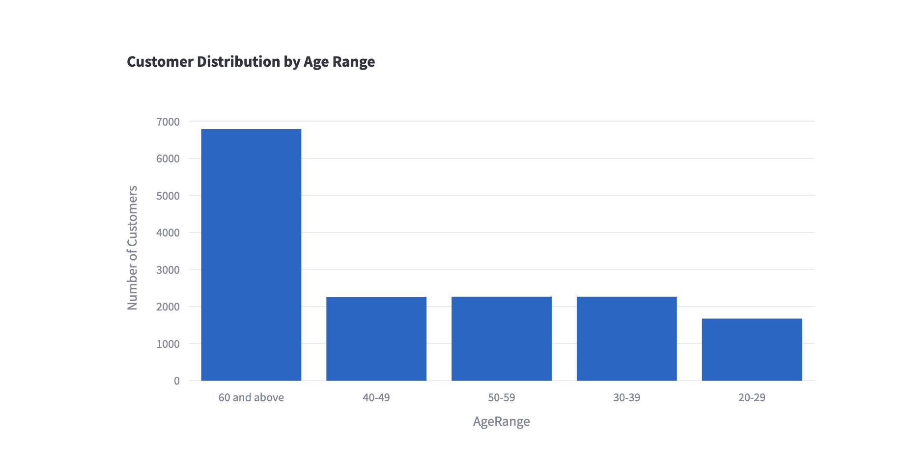
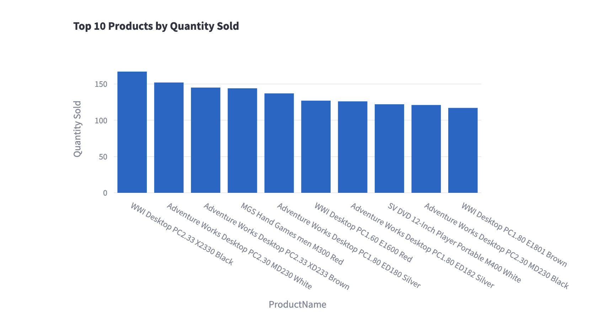
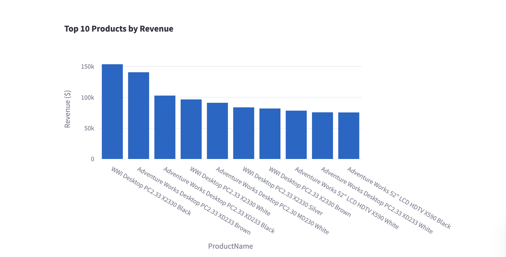
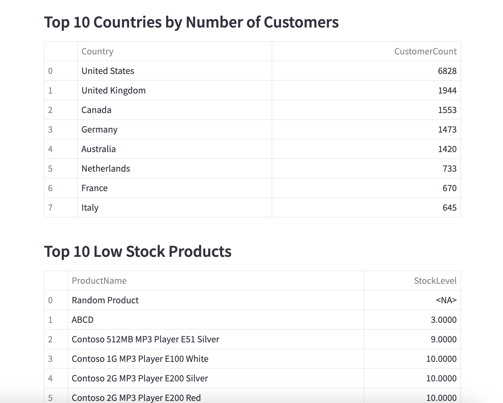

## Result

The Customer Relationship and Product Management (CRPM) System successfully addresses the need for a comprehensive tool to manage customer relationships, product inventories, and purchase transactions. By utilizing Python and Object-Oriented Programming (OOP) principles, the backend ensures a robust and scalable solution for data processing and interaction with a relational database. The integration of MySQL for efficient data storage and retrieval enables seamless tracking of customers, products, and sales transactions. The front-end, built using Streamlit, offers an intuitive and interactive user interface, making it easy for users to add, update, and manage customer and product data, as well as view detailed sales reports and analytics. This system improves business operations by streamlining customer management, enabling real-time insights, and enhancing decision-making through data-driven analytics.


