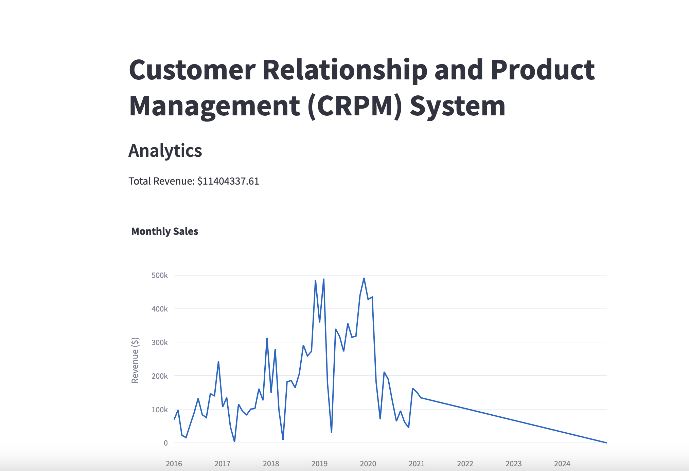

# Customer Relationship and Product Management (CRPM) System

## Problem Statement:
Develop a comprehensive Customer Relationship and Product Management (CRPM) System that integrates backend functionality using Python and Object-Oriented Programming (OOP), a relational database, and a front-end framework. The application will enable users to manage customers, products, and customer purchases in a seamless, interactive interface.

## Requirements and Features

### 1. Customer Management

- Add Customers: Allow users to input customer details (Name, Email, Phone Number and other required information for your business).
- View Customers: Display a list of all customers stored in the database.
- Update Customer Details: Modify customer information using their unique Customer ID.
- Delete/De-activate Customers: Remove or de-activate customers from the system.

### 2. Product Management

- Add Products: Enable users to input product details (Name, Price, Stock Quantity and other required information for your business).
- View Products: Display a list of all available products.
- Update Product Details: Allow editing of product details such as name, price, and stock.
- Delete/De-activate Products: Remove or de-activate products from the system.

### 3.Customer Purchases

- Record Purchases: Enable users to log purchases by linking a customer to a product and specifying the quantity. Ensure the system updates product stock automatically after a purchase.
- View Purchase History: Display all purchases made by a specific customer, showing the product details, quantity purchased, and total cost.

### 4. Analytics and Reports

- Generate Sales Reports: Display total revenue generated, number of products sold, and stock updates and other key information.
- Display Top Customers: Rank customers based on their purchase history.
- Visualize Product Performance: Show product trends (e.g., best-selling and least-selling products).

### 5. User Interface
- Use a front-end framework (e.g., Streamlit, Gradio, Flask, or Django) to create an interactive user interface with the following features:
- Navigation between modules (Customer Management, Product Management, Purchases, Analytics).
- Forms for data input.
- Tables to display data.

## Approach:
### Data Cleaning and Preparation
Checking for missing values and handle them appropriately.
Converting data types where necessary (e.g., dates, numerical values).
Merging datasets where necessary for analysis (e.g., linking sales data with product and customer data).
### Load Data
Inserting the preprocessed data into an SQL database by creating relevant tables for each data source and using SQL INSERT statements to load the data.
### Develop SQL Queries
Formulating and executing SQL queries to extract key insights from the data. These queries should address important business questions and support the analysis steps below.

## Analysis Steps:

### Customer Analysis
Demographic Distribution: Analyze the distribution of customers based on gender, age (calculated from birthday), location (city, state, country, continent).
Purchase Patterns: Identify purchasing patterns such as average order value, frequency of purchases, and preferred products.
Segmentation: Segment customers based on demographics and purchasing behavior to identify key customer groups.
### Sales Analysis
Overall Sales Performance: Analyze total sales over time, identifying trends and seasonality
Sales by Product: Evaluate which products are the top performers in terms of quantity sold and revenue generated.
Sales by Store: Assess the performance of different stores based on sales data.
Sales by Currency: Examine how different currencies impact sales figures, considering exchange rates.
### Product Analysis
Product Popularity: Identify the most and least popular products based on sales data.
Profitability Analysis: Calculate profit margins for products by comparing unit cost and unit price.
Category Analysis: Analyze sales performance across different product categories and subcategories.

## Customer Management Page
Here we can add new customers, and view available customers

## Product Management Page
Here we can add new products, view available products, and also change the status of the product to active or inactive

## Customer Purchase
Here we can add new customer orders, view available sales done as well

## Analytics Page
Here we can see some analytics of the database 

